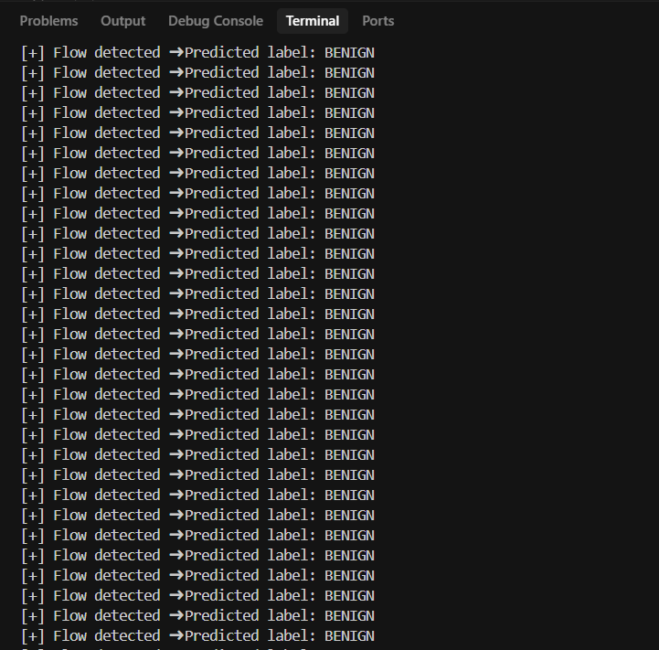
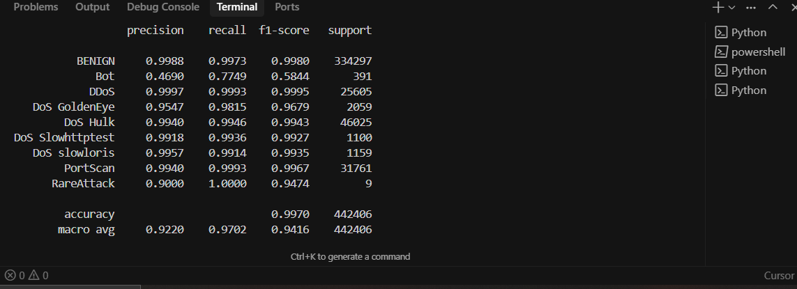
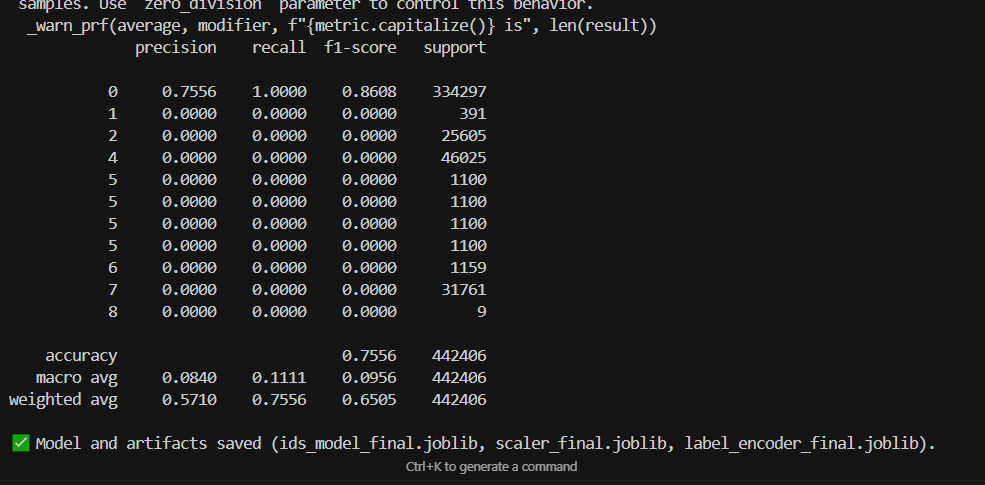

# 🚀 AI-Powered Intrusion Detection System (IDS)

Detect cyber attacks *in real time* with cutting-edge AI! This project harnesses **XGBoost** and the massive **CICIDS2017** dataset to build a super-accurate network intrusion detection system — ready for deployment.

---

## ✨ Highlights

- 💥 Processed **2.2 million+** network flows from CICIDS2017 — massive scale!
- 🎯 Balanced tricky class imbalances with **SMOTE** to catch rare attacks.
- 🔥 Combined rare attacks into a unified **RareAttack** category for cleaner predictions.
- ⚡ Integrated **NFStreamer-compatible** features for lightning-fast, live packet classification.
- 📈 Achieved a **99.8% weighted F1-score** across 9 attack types — DDoS, PortScan, Botnet & more.
- 💾 Exported trained model & preprocessing pipeline as `.joblib` files for seamless deployment.
- 🔍 Rigorous **cross-validation** and sanity checks to ensure rock-solid accuracy.

---

## 🚀 Getting Started

### What You Need

- Python 3.8+ installed
- Dependencies — just run:

  ```bash
  pip install pandas numpy scikit-learn imbalanced-learn xgboost joblib

    Combined CICIDS2017 dataset (combine.csv) with NFStreamer features
🧠 How to Use
🛠 Model Training (Offline)

    Load and clean CICIDS2017 data

    Apply SMOTE to balance class distribution

    Train using XGBClassifier

    Evaluate with F1-score and confusion matrix

    Export model, scaler, and label encoder

    Run the full training pipeline:
    python ids_training.py

🌐 Real-Time Detection (NFStreamer)

    Connect to a live network interface (e.g., Wi-Fi, Ethernet)

    Extract features using NFStreamer

    Scale and predict using trained model

    Print predicted labels in real time

    Run the real-time system:
    python realtime_nfstream.py

📉 Results at a Glance
Metric	Score
Accuracy	99.7%
F1 (Weighted)	99.8%
Classes	9 (e.g., DoS, DDoS, Bot, PortScan, RareAttack)

    Top features: Bwd Packet Length Std, Avg Packet Size, PSH Flag Count, ...

🧪 Attack Simulation (Safe Environment Only)
1. 🧨 DoS - Slowloris

# Launch a test server
python -m http.server 80

# Simulate attack (from another terminal/VM)
git clone https://github.com/gkbrk/slowloris
cd slowloris
python3 slowloris.py 127.0.0.1

2. 💣 SYN/UDP Floods & PortScan - hping3

# Install: sudo apt install hping3

# SYN Flood
sudo hping3 -S -p 80 --flood 127.0.0.1

# UDP Flood
sudo hping3 --udp -p 53 --flood 127.0.0.1

# Port Scan
sudo hping3 -S -p ++20 -c 100 127.0.0.1

3. 🦠 Botnet Emulation (VM Only)

Tools like LOIC, HOIC, or Metasploit can emulate attacks but must be run in isolated test labs only.
🔒 Safety Warning

    NEVER run attacks on public networks

    Use only inside VMs or isolated test environments

    Protect your host system with firewalls and snapshots

📥 Dataset Source

    📄 CICIDS2017 Dataset

📝 License

MIT License — free to use, adapt, and modify for your own research or deployment.

## 🔍 Demo Output






